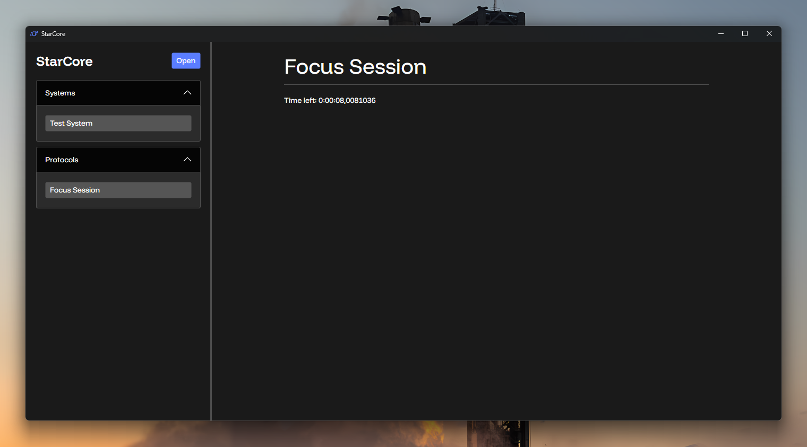

**StarCore is an open-sourced framework for building systems and protocols to organize your life.**

Put in other words: It's the coolest and most overkill tool to organize and automate your life you'll ever need.

*Screenshot of StarCore Proof of Concept*

## Project Overview

StarCore is a framework for building cross-platform systems and protocols that manage different aspects of your life.
Think of it as a personal operating system and automation engine.

### ⚙️ Systems

Systems are persistent hubs that you code to manage different aspects of your life. Systems manage data and perform 
actions intelligently. Systems can define a UI for you to interact with, and they can connect and exchange data with 
others. You can create and customize systems to adapt to how you work.

Imagine a world where:

- Your Task Manager, Calendar System and Project Manager connect to each other and adapt to how you work
- A Music System gets data about your mood and energy from other systems and plays music accordingly
- A Filament Tracker automatically tracks your filament usage for each spool

...and you can create intelligent systems to manage anything you can imagine

### ⚙️ ️Protocols

Protocols are interactive automations that handle temporary actions. They can also define UIs, perform native actions 
and interact with other systems and protocols.

Imagine a world where:

- When you send a print to your 3D printer, a Printing Protocol opens that reminds you to ventilate and logs your 
filament usage on the Filament Tracker.
- When you add an exam to your calendar, an Exam Protocol is opened that automatically adds revision tasks to your
Task Manager.
- You can open a Focus Protocol that helps you focus on a task, blocks distracting apps and automatically generates 
journal entries for Hack Club hardware projects.

...and you can create intelligent protocols to automate anything you can think of

## Why I built this

I lack an external structure that forces me to do the right thing at the right time. I need something that recognizes 
certain behaviors or responds to certain triggers and performs the right actions intelligently.

Of course, I did the sensible thing and over-engineered a cross-platform framework to solve that!

Maybe this is not the most efficient way to solve the problem but it for sure is really cool.

## Getting started

StarCore is a work in progress and most of the features described above are not available yet. However, you can install
a proof of concept with a working communication and instance management systems from the [Releases tab](https://github.com/Mikuel210/StarCore/releases/latest).

---

Made with ❤️ for Moonshot thanks to Hack Club

  

